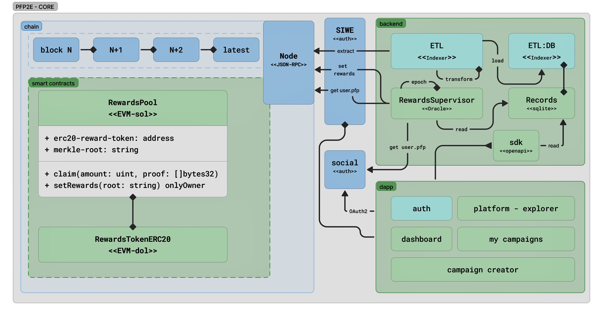

<div align="center">

# PFP2E Protocol
### Verifiable Visual Identity · Programmable Rewards

</div>

---

### PFP2E is a hybrid on-chain/off-chain protocol for verifying visual identity and linking it to a trustless reward system. This repository contains the reference implementation built for the ETHGlobal hackathon.



---

### Design Philosophy: Pragmatic Simplicity
This project was built in a constrained, hackathon environment. We prioritized a clean, working, end-to-end demo over feature-completeness. The architecture is intentionally simple, the contracts are minimal, and the code is written for clarity.

---

### Development Environment
This project provides two development setups, both managed by **[Task](https://taskfile.dev/)**. The root `Taskfile.yml` is the single entry point for all workflows.

**Prerequisites:**
-   [**Task**](https://taskfile.dev/installation/)
-   [**Docker**](https://www.docker.com/get-started) (for container workflow)
-   [**Bun**](https://bun.sh/) (for local workflow)

---

#### Container Workflow (Recommended)
This setup uses Docker to provide a consistent, reproducible environment. All commands are run from the project root.

```bash
# Start the demo development server
task demo:dev

# Run the demo test suite
task demo:test

# Stop all demo services
task demo:stop
```

---

#### Local Workflow
This setup runs services directly on your host machine. It requires `bun` to be installed.

```bash
# Start the demo development server locally
task demo:dev:local

# Run the demo test suite locally
task demo:test:local
```

---

### Repository Guide
This repository is a monorepo organized by domain.

| Module | Description |
| :--- | :--- |
| **[`/contracts`](./contracts)** | The on-chain settlement layer (`Solidity`, `Hardhat`). |
| **[`/loop`](./loop)** | The off-chain verification engine (`Node.js`, `SQLite`). |
| **[`/demo`](./demo)** | Frontend proofs-of-concept (`Next.js`, `Task`). |
| **[`/docs`](./docs)** | System architecture diagrams. |

---

<div align="center">


</div>
